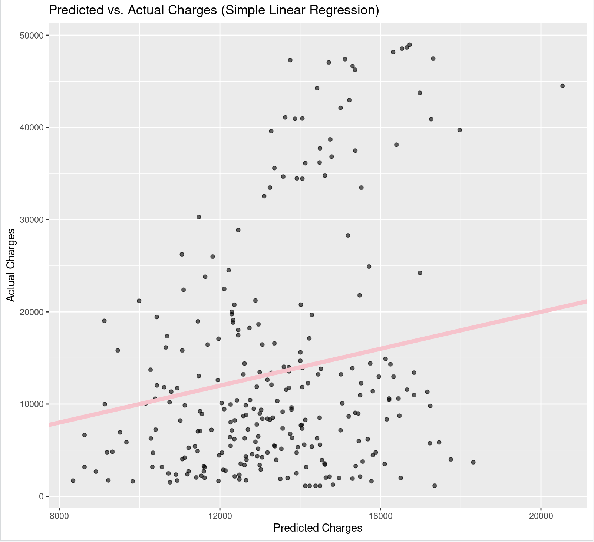
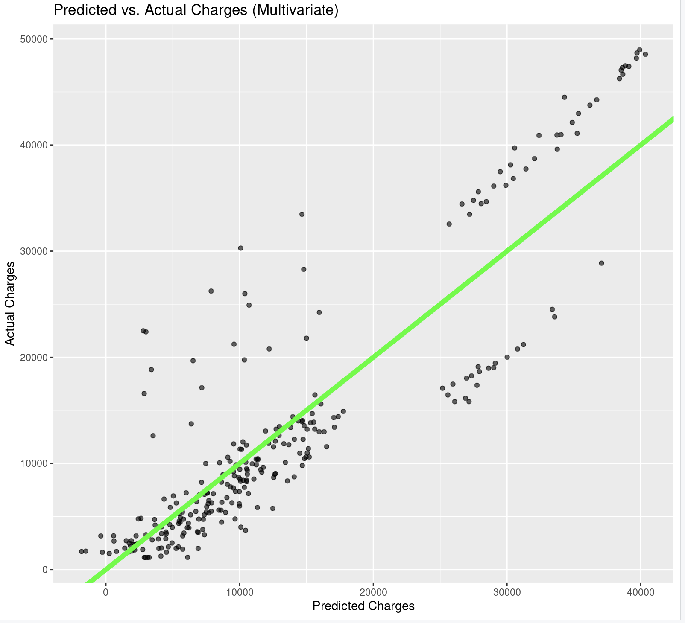

# Medical Insurance Costs Prediction

# Table of Contents
- [Project Overview](#project-overview)
    - [Objective](#objective)
    - [Research Questions](#research-questions)
    - [Tools and Libraries](#tools-and-libraries)
- [Data Exploration](#data-exploration)
- [Data Wrangling](#data-wrangling)
- [Model Summary](#model-summary)
- [Visualizations](#visualizations)
    - [Simple Linear Model](#simple-linear-model)
    - [Multivariate Model](#multivariate-model)
- [Statistical Analysis](#statistical-analysis)
- [Experimentation](#experimentation)
- [Conclusion](#conclusion)
- [Files](#files)
  

# Project Overview
This project explores the factors that influence total medical insurance costs for individuals in the United States. Two regression models, a simple linear and a multivariate, were built, compared, and analyzed to determine performance. I used R and ggplot2 for analysis and visualization, and presented my findings in a final slide deck as part of University of Washington's DATAANA course.

### Objective
The primary objective is to predict medical insurance costs, evaluate prediction models, and understand how variables such as age, bmi, and smoker status affect individual charges.

### Research Questions
- Which demographic and lifestyle variables are most strongly associated with predicting insurance charges?
- To what extent does BMI (body mass index) predict higher insurance costs?
- Is this a significant difference in medical insurance charges between smokers and non-smokers?

## Tools and Libraries

- **Language:** R
- **Libraries:** ggplot2, dplyr, caret
- **Environment:** Jupyter Notebook via R kernel

# Data Exploration

- Insurance charges ranged from **$1,122** to **$63,770** with a right-skewed distribution
- **1,064** non-smokers and **274** smokers
- BMI ranged from **16** to **33**
- The mean number of children in household is **1.1**
  
**Demographics Overview**
- Fair distribution across age, sex, and region
    - Median age: 39 years
    - Each region (Northeast, Midwest, South, and West) has 324-364 individuals
    - Balanced female vs male proportions

**Variable Types**
- Categorical: sex, smoker, region
- Numerical: age, bmi, children, charges

# Data Wrangling

1. Checked for Data Quality Issues
- Verified that there were no missing values in the dataset
- Assessed data types for consistency and corrected as needed
3. Explored Outliers
- Used quantile() and boxplots to examine variable distributions
- Determined that BMI had outliers within reasonable ranges and charges displayed significant variance with a right-skewed distribution due to high-cost outliers
- No outliers were removed since they were deemed to be important since large variances are common in health insurance
4. Prepared Categorical Variables
- Converted categorical variables (sex, smoker, region) into factor types

# Model Summary
**Model #1** Simple Linear Regression, using BMI as the only predictor of insurance costs

    lm(charges ~ bmi, data = insurance)

Performance: BMI is a weak predictor alone (low R2 ≈ 0.07)

RMSE: ~$12,092

R²: 0.07

This model uses BMI as the sole predictor. It explains only 7% of the variation in insurance charges, with an average prediction error of over $12,000. This suggests BMI alone is not a strong predictor of cost.

**Model #2** Multivariate Regression, using all variables except for sex as predictors of insurance costs

    multiple_model <- lm(charges ~ .  - sex, data = insurance)

Performance: Strong relationships between several predictors and charges( R2 ≈ 0.77)

RMSE: ~$5,972

R²: 0.77

This model includes multiple predictors (age, BMI, children, smoking status, region) and performs significantly better. It explains 77% of the variance in charges and reduces the average prediction error by over 50%, making it far more reliable.

**Key Predictors**
- Smoker status was the strongest predictor
- Age, BMI, and number of children were also signficiant variables

# Visualizations
Scatterplots visualize the predicted charges (in points) from the each model versus the actual individual charges (in line) from the dataset. The closer the slope is to 1, the more accurate the predictions are. 

## Simple Linear Model



## Multivariate Model



# Statistical Analysis
**Hypotheses**
- Null hypothesis (H₀): There is no significant difference in average insurance charges between smokers and non-smokers.
- Altenative Hypothesis (H1): Smokers have significantly higher average insurance charges than non-smokers.
    
**Interpretation:**

There is strong statistical evidence that smokers have significantly higher medical insurance charges compared to non-smokers. On average, smokers pay approximately $23,616 more. The p-value is very close to zero, so the difference between the two groups is statistically significant. The negative and fairly large t-value and confidence interval also reflects the fact that smokers have much higher and signficant insurances chargers compared to non-smokers

```r
# Perform a two-sample t-test to compare smokers vs non-smokers
t_test_result <- t.test(charges ~ smoker, data = insurance)
t_test_result
```
    Welch Two Sample t-test
    data:  charges by smoker
    t = -32.752, df = 311.85, p-value < 2.2e-16

The result is statistically significant. Reject the null hypothesis.


# Experimentation

The Northwest region had a p-value < 0.05, so an alternative model was created to test the impact of the region variable. The resulting RMSE increased slightly from 5,972 to 5,988 and the adjusted R² dropped by just 0.07%, indicating minimal impact on model performance. Based on these metrics, the region variable could be potentially excluded in order to simplify the model. 

# Conclusion
This analysis used linear regression and hypothesis testing to explore key drivers of medical insurance charges. Smoking status, age, BMI, and number of children were significant predictors, with smoking having the greatest impact. The multivariate model outperformed the simple model (R² ≈ 0.75 vs. 0.07), and a t-test confirmed that smokers are charged significantly more, with an average difference of over $23,000.

# Files

- Full analysis with code and commentary [here](https://github.com/ssz-119/insurance-model/blob/main/medical_r_analysis.ipynb)
- Final project presentation slides [here](https://github.com/ssz-119/insurance-model/blob/main/insurance_slides.pdf)
- Dataset Source: [Kaggle Medical Cost Personal Dataset](https://www.kaggle.com/datasets/mirichoi0218/insurance) (Open Data - Database Content License)

